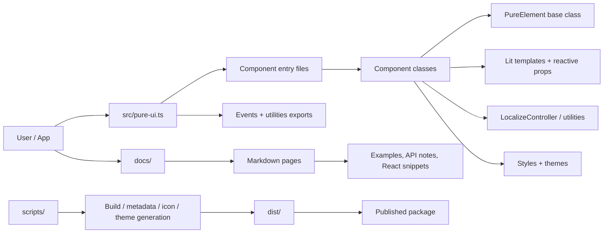
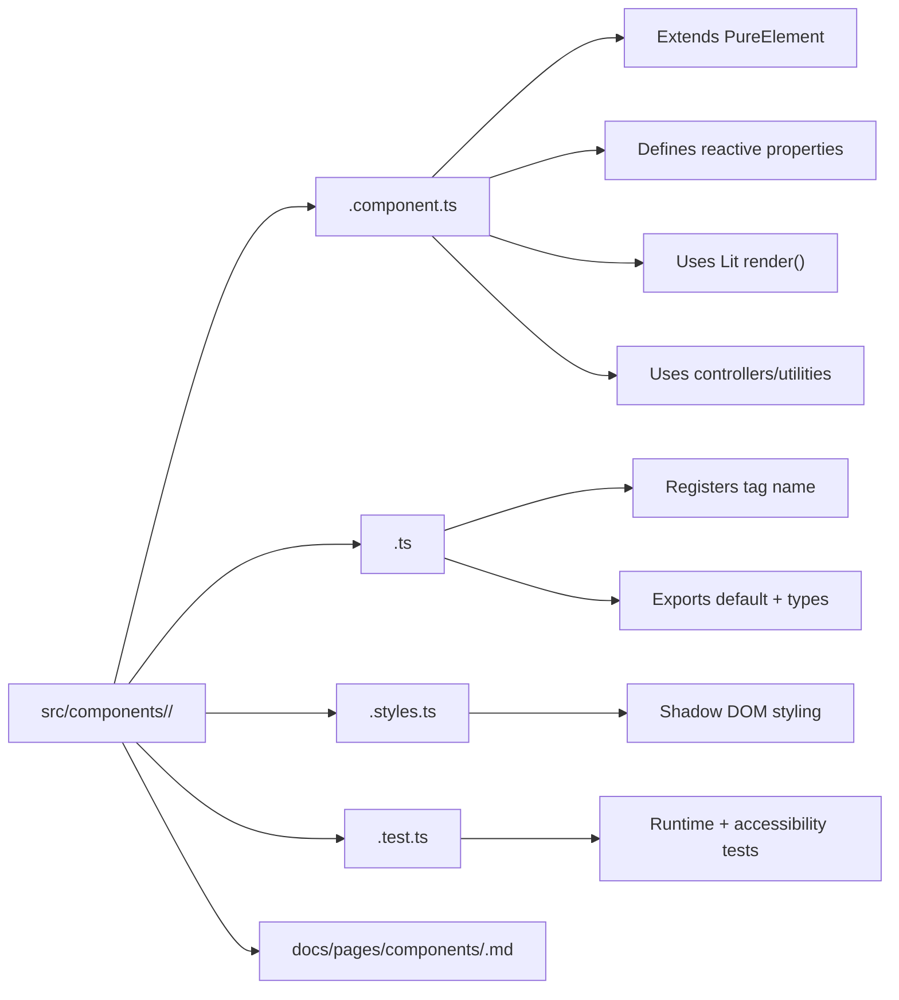
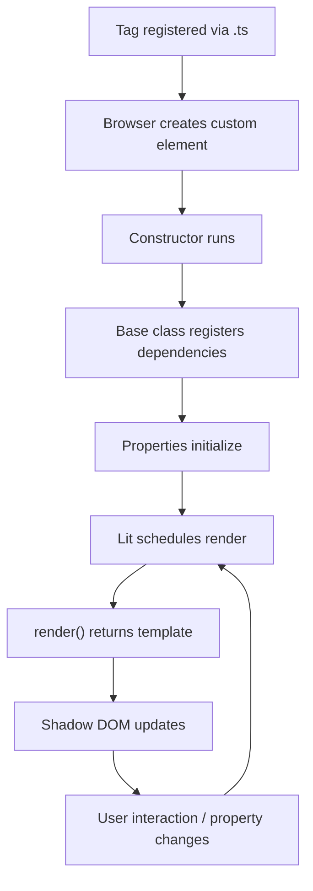

---
meta:
  title: Architecture
  description: Visual overview of the PureUI project structure and how each component is organized.
layout: default
---

# Architecture

This page documents the internal structure of PureUI at two levels:

1. How the full project fits together.
2. How an individual component is organized.

## Project Overview

PureUI is a Lit-based web component library. Source code lives in `src/`, docs live in `docs/`, and build scripts generate the distributable output in `dist/`.

## Component Anatomy

Most components follow the same split:

- `*.component.ts` contains the Lit component implementation.
- `*.ts` registers the custom element and re-exports the class.
- `*.styles.ts` contains component styling.
- `*.test.ts` verifies behavior and accessibility.
- `docs/pages/components/*.md` describes usage and examples.

## Component Lifecycle

The typical runtime flow for a component is:

## Key Repository Areas

- `src/components/` holds the component source.
- `src/internal/` holds shared foundation code.
- `src/utilities/` contains controllers and helpers.
- `src/events/` defines shared custom event types.
- `src/themes/` contains theme CSS.
- `docs/` contains the generated documentation site.
- `scripts/` contains build and generation tooling.

## Notes

- Components are designed to be framework-agnostic because they are standards-based custom elements.
- Localization is handled through `LocalizeController` and browser APIs such as `Intl.DateTimeFormat` and `Intl.RelativeTimeFormat`.
- The public API is assembled from `src/pure-ui.ts`, which serves as the main entry point for the package.
